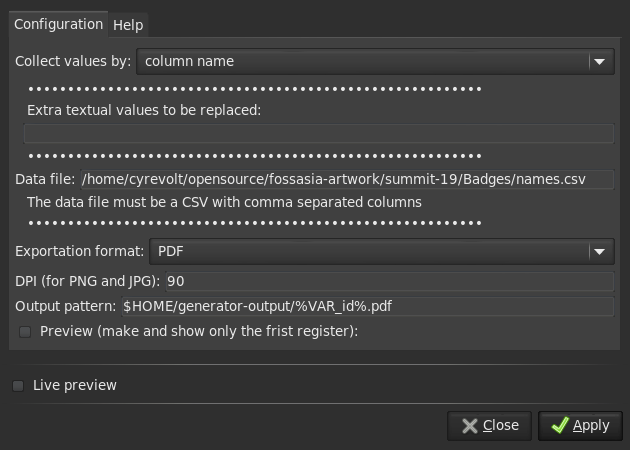

# Badges quick guide

## Preparation

Create CSV files with the names in the following format (mind the empty line at
the end of the file):

```csv
id,name1,name2,name3,name4
1,Jessa Jones,Peter Parker,Ada Lovelace,Rick Sanchez
2,Adriana C. Ocampo Uria,Cecilia Payne-Gaposchkin,Chien-Shiung Wu,Geraldine Seydoux
3,Nicolaus Copernicus,Stephen Hawking,,

```

The first column will determine the file name of the generated PDFs. Since the SVGs
have 4 badges per sheet, there need to be 4 names per row. The seperator *must* be
an actual comma (`,`). You can use any tool to create/edit the CSV files.

## Inkscape extension
1. download http://wiki.colivre.net/pub/Aurium/InkscapeGenerator/ink-generator.tgz
2. extract into your Inkscape config/extensions directory (`~/.config/inkscape/extensions`)
3. restart Inkscape

## Generate badges

Open one of the SVGs and add text fields with placeholders in the form
`%VAR_name1%`, `%VAR_name2%`, `%VAR_name3%`, `%VAR_name4%`, corresponding with
the column names in the CSV files. See the participant badge SVG as an example.

From the menu bar, select *Extensions* -> *Misc* -> *Generator*.



Set *Collect values by* to `column name`, enter the location of the respective
CSV file as the *Data file*, choose your preferred *Exportation format*, and
for the *Output pattern*, enter `$HOME/generator-output/%VAR_id%.pdf` (or adjust
the directory to your liking). Now click *Apply* to generate the files.
